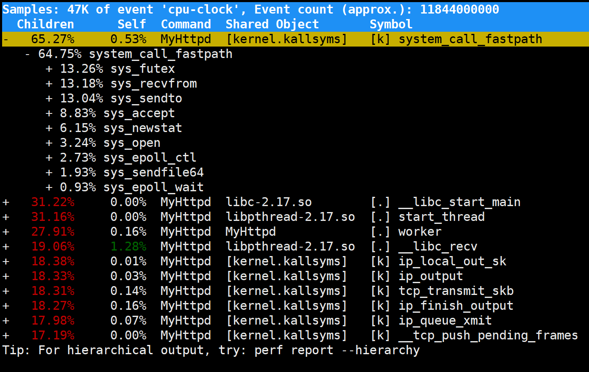

## 项目简介：

## Tinyhttpd with threadpoll & epoll

------

​	本项目是基于Tinyhttpd扩展实现的web服务器， 基于epoll 事件驱动IO， 采用高效的Reactor 模型 与 线程池 的方式，解决原版动态创建存在效率较低、并发低的问题， 较于原版接近十五倍性能。


## 程序框架：

------


## 项目构建方法：

------


```shell
git clone git@github.com:githubzijian/TinyHttpd-with-ThreadPool-and-Epoll.git
mv  www /var
chmod +x /var/www/html/*.cgi
chmod 600 /var/www/html/*.html
mkdir build
cd build && cmake ..
make

#运行方式：
#./MyHttpd <ip> <port>

#例如：
#./MyHttpd 10.0.0.3 5000
```


## 技术要点：

------

- 采用 Reactor 并发模式

- Epoll I/O多路复用技术

- 线程池（互斥锁、条件变量的使用）：根据工作量动态调整线程个数。

- socket 网络编程

- 进程通信

  

## 测试方法 和 结果：

------


```shell
webbench -c 1000 -t 30 http://10.0.0.3:5/
#或者
ab -n1000 -c30 http://10.0.0.3:80/
```

```shell
#原版代码测试结果
[root@demo build]# webbench -c 100 -t 20 http://10.0.0.3:5000/
Webbench - Simple Web Benchmark 1.5
Copyright (c) Radim Kolar 1997-2004, GPL Open Source Software.

Benchmarking: GET http://10.0.0.3:5000/
100 clients, running 20 sec.

Speed=24486 pages/min, 122195 bytes/sec.
Requests: 8152 susceed, 10 failed.
```

```shell
#使用线程池代码测试结果
[root@demo build]# webbench -c 100 -t 20 http://10.0.0.3:5000/
Webbench - Simple Web Benchmark 1.5
Copyright (c) Radim Kolar 1997-2004, GPL Open Source Software.

Benchmarking: GET http://10.0.0.3:5000/
100 clients, running 20 sec.

Speed=398880 pages/min, 1987752 bytes/sec.
Requests: 132960 susceed, 0 failed.
```


## 项目不足与改进点：

------

#### 		不足：

- 代码启动后，压测的同时，服务器使用 top 观察系统的各项占用情况，发现 软中断 si 较高，用户 us 占用较少。

- 使用perf 观察热点函数， 确定问题所在，是频繁 IO 读写导致的

- 线程池使用了互斥锁， 可以考虑采用无锁模式

  

  #### 改进：

- 把多线程改为多进程，主进程专门负责处理IO，统一事件源， 其余进程通过共享内存和管道 的IPC方式更好，因为多线程，如果其中一个线程出现差错，这通常会导致整个进程崩溃。

- epoll 边缘触发 ET 结合非阻塞IO，一次性把数据读取，减少上下文切换次数，提高效率。

  

  #### perf结果：

  


## 参考文献：

------

[Tinyhttpd](https://github.com/cbsheng/tinyhttpd)

[《Linux高性能服务器编程》](#)

